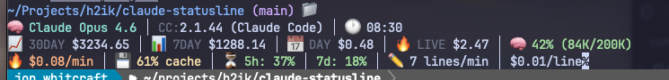

# claude-statusline

A fast, informative statusline for [Claude Code](https://docs.anthropic.com/en/docs/claude-code) — built in Go.



## What It Does

claude-statusline displays live session data directly in your Claude Code terminal: repository status, model info, cost tracking, context usage, and more. It replaces the default statusline with a richer, faster alternative styled with the Catppuccin Mocha theme.

## Features

- **Fast** — Single compiled binary; no subprocess spawning
- **Cached** — AWS Bedrock resolution and version checks avoid repeated lookups
- **Cost tracking** — See spending across four windows: 30-day, 7-day, daily, and live
- **Styled** — Catppuccin Mocha color theme via [lipgloss](https://github.com/charmbracelet/lipgloss)
- **Powerline mode** — Optional powerline-style rendering with colored segments and right-aligned components (requires a [Nerd Font](https://www.nerdfonts.com/))

## Install

### Homebrew (recommended)

```bash
brew install --cask h2ik/tap/claude-statusline
```

### From source

```bash
go build -o claude-statusline .
cp claude-statusline ~/.local/bin/
```

## Setup

Add this to your `~/.claude/settings.json`:

```json
{
  "statusLine": {
    "type": "command",
    "command": "claude-statusline"
  }
}
```

If the binary isn't on your `PATH`, use the full path:

```json
{
  "statusLine": {
    "type": "command",
    "command": "/Users/YOUR_USER/.local/bin/claude-statusline"
  }
}
```

Claude Code sends JSON to the statusline on each render cycle. The statusline reads that input, resolves model, cost, and repo data, then writes styled output back.

## Layout

By default the statusline renders four lines of information:

| Line | Content |
|------|---------|
| **1** | Repository path, branch, clean/dirty status, worktree |
| **2** | Model, commits today, submodules, version, time |
| **3** | Cost (30-day, 7-day, daily, live), context window, output style |
| **4** | Burn rate, cache efficiency, block projection, code productivity |

**Line 4** is most useful for direct Anthropic API users. Bedrock users will see empty components where rate-limit data is unavailable.

### Styles

Two rendering styles are available:

- **`default`** — Components joined by `│` separators (no special font required)
- **`powerline`** — Colored background segments with arrow separators and right-alignment support (requires a [Nerd Font](https://www.nerdfonts.com/))

Powerline mode groups components into colored segments by category (info, cost, metrics, activity, meta) and supports placing components on the right side of the terminal.

### Icon styles

Two icon sets are available:

- **`emoji`** (default) — Standard Unicode emoji characters. Works everywhere, no special font required.
- **`nerd-font`** — Single-cell [Nerd Font](https://www.nerdfonts.com/) glyphs. Renders cleanly in powerline segments without width miscalculations or background color bleed. Requires a Nerd Font-patched terminal font.

Set `icon_style` in the `[layout]` section of your config:

```toml
[layout]
style = "powerline"
icon_style = "nerd-font"
```

When `icon_style` is omitted or empty, it defaults to `"emoji"`.

### Color themes

Four [Catppuccin](https://catppuccin.com/) color palettes are available:

- **`catppuccin-mocha`** (default) — Dark theme with pastel accents
- **`catppuccin-macchiato`** — Dark theme, slightly lighter base
- **`catppuccin-frappe`** — Medium-dark theme
- **`catppuccin-latte`** — Light theme with saturated accents

Set `theme` in the `[layout]` section of your config:

```toml
[layout]
theme = "catppuccin-frappe"
style = "powerline"
```

When `theme` is omitted or empty, it defaults to `"catppuccin-mocha"`. The light theme (Latte) automatically inverts powerline segment contrast for readability.

### Path compression

Long directory paths eat into available terminal width, especially in powerline mode with right-aligned components. The `repo_info` component supports Fish-style path compression that shortens intermediate directories to their first letter while keeping the repository name and subdirectories intact.

Two `path_style` values are available:

- **`full`** (default) — Display the complete path: `~/Projects/h2ik/claude-statusline/internal`
- **`compress`** — Shorten intermediate directories above the repo root: `~/P/h/claude-statusline/internal`

Set `path_style` under `[components.repo_info]`:

```toml
[components.repo_info]
path_style = "compress"
```

The powerline default config enables compression automatically on first run. Existing users must add the `[components.repo_info]` section to their config manually.

## Configuration

The statusline reads its config from `~/.claude/statusline/config.toml`. A default file is created on first run.

### Default style

```toml
[layout]
theme = "catppuccin-mocha"
style = "default"
icon_style = "emoji"

[[layout.lines]]
left = ["repo_info"]

[[layout.lines]]
left = ["bedrock_model", "model_info", "commits", "submodules", "version_info", "time_display"]

[[layout.lines]]
left = ["cost_monthly", "cost_weekly", "cost_daily", "cost_live", "context_window", "session_mode"]

[[layout.lines]]
left = ["burn_rate", "cache_efficiency", "block_projection", "code_productivity"]

[components.bedrock_model]
show_region = true

[components.context_window]
show_tokens = true

[components.code_productivity]
show_velocity = true
show_cost_per_line = true
```

### Powerline style

Powerline mode uses colored background segments with arrow separators and supports placing components on the right side of the terminal. Requires a [Nerd Font](https://www.nerdfonts.com/).

```toml
[layout]
theme = "catppuccin-mocha"
style = "powerline"
icon_style = "nerd-font"

[[layout.lines]]
left  = ["repo_info", "bedrock_model", "model_info"]
right = ["commits", "submodules", "version_info", "time_display"]

[[layout.lines]]
left  = ["cost_monthly", "cost_weekly", "cost_daily", "cost_live"]
right = ["context_window", "session_mode", "burn_rate", "cache_efficiency", "block_projection", "code_productivity"]

[components.repo_info]
path_style = "compress"

[components.bedrock_model]
show_region = true

[components.context_window]
show_tokens = true

[components.code_productivity]
show_velocity = true
show_cost_per_line = true
```

Terminal width is detected automatically. The statusline tries `stderr`/`stdout` tty detection, then `/dev/tty`, then the `COLUMNS` environment variable, and defaults to 80 columns. Set `COLUMNS` as an override when running as a subprocess (e.g., Claude Code) where tty detection is unavailable.

> **Backward compatibility:** The old flat `lines = [["repo_info"], ...]` format is still supported and auto-migrated to the new format at load time.

## Development

Run tests:

```bash
go test ./...
```

Build:

```bash
go build -o claude-statusline .
```

Test with sample input:

```bash
echo '{"workspace":{"current_dir":"'$(pwd)'"},"model":{"display_name":"Claude"}}' | ./claude-statusline
```

## Architecture

See [docs/ARCHITECTURE.md](docs/ARCHITECTURE.md) for details.
